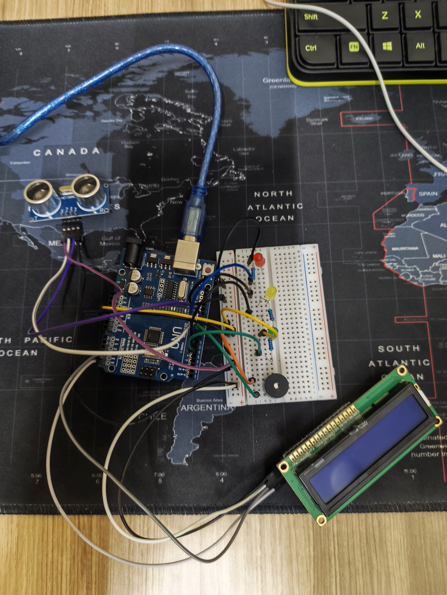

# Smart Distance Alert System (Arduino)

## 📌 Description

This project implements a real-time distance monitoring system using an ultrasonic sensor.
It provides multi-level alerts using LEDs, buzzer, and LCD display with time-based validation to reduce false triggers.

---

## 🧰 Components Used

* Arduino Uno
* HC-SR04 Ultrasonic Sensor
* LCD 16x2 (I2C)
* Red, Yellow, Green LEDs
* Buzzer
* Resistors

---

## ⚙️ Working Logic

### 🔴 Danger (<10 cm)

* Red LED ON
* Continuous buzzer
* LCD shows **DANGER**

### 🟡 Warning (10–30 cm)

* Yellow LED blinks
* Buzzer beeps intermittently
* LCD shows **WARNING**

### 🟢 Safe (>30 cm)

* Green LED ON
* No buzzer
* LCD shows **SAFE**

---

## ⏱️ Advanced Features

* Time-based validation (2 sec delay to avoid false triggers)
* Distance averaging for stable readings
* Non-blocking logic using `millis()`
* Multi-output feedback system

---

## 🧠 System Design

Input → Ultrasonic Sensor
Processing → Distance filtering + decision logic
Output → LEDs + Buzzer + LCD

---

## 📷 Project Setup

---

## 🎥 Demo Video

[Watch Demo](PASTE_YOUTUBE_LINK_HERE)

---

## 💻 Code

See `smart_distance_alert.ino`

---

## 📊 Learning Outcomes

* Sensor interfacing
* Embedded system design
* Real-time decision making
* Hardware-software integration

---

## 🚀 Future Improvements

* Add IoT monitoring
* Adjustable thresholds using potentiometer
* Enclosure for real-world deployment

---
